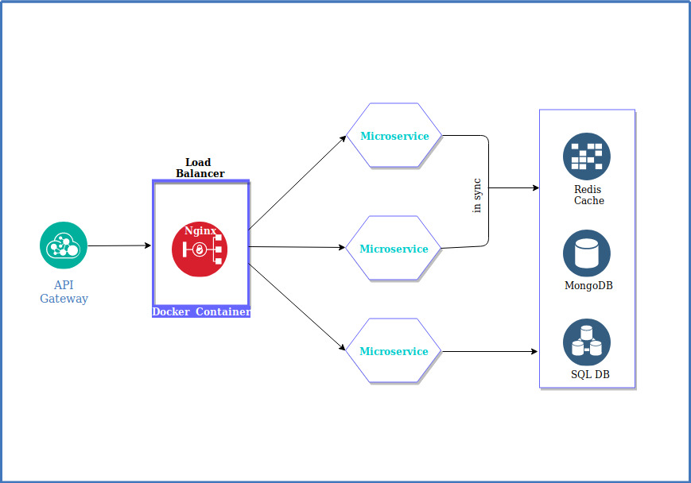

# Business Automation Case Study
## Case Study
In order to achieve their goals,organizations collaborate with business partners.Such collaborations represent enactments of inter-organizational business processes and may be supported through the exchange of Electronic  Data  Interchange (EDI) messages (e.g., electronic purchase orders,invoices  etc.),web API's, or etc.

In order to automate the inter-organizational business process of ordering,despatching and invoicing of goods belonging to a consumer goods manufacturer which relied on web API's,EDI,and some other processes without changing their existing ERP or CRM.

A microservice was developed (using Nodejs,Nginx and Docker)to manage network traffic and collect data from various interactions between different teams.This also made it easy to deploy task specific models as per different company processes.

</img>

figure above is a basic idea of how microservices were used, although the orignal architecture was much more complex.

### Automation Requirements

1. Forecasts the requirement's for goods ahead of time and scheduling delivery automatically if needed.

2. Real time response over the text message/email and automatically adding important events to your calendar. 

3. Evaluating performance week over week and provide insight's to make move-ins.

### Technical Requirements

1. This process required various NlP task's ie. <b>machine translation task</b> like converting EDIFACT/ANSI X12 format to English,<b>Named Entity Recognition</b>,<b>Dialogue Act Recognition</b>.To solve this we built an Encoder-Decoder LSTM architecture that was trained on various types data relating to different business processes.
2. In order to felicitate timely deliveries,we needed build a <b>forcasting model</b> based on
previous sales data,weather condition and other factors.

### Challenges and Solution
 
A common problem to deal with Linguistic Modelling is majority of data is unstructured (schemas,EDI formats,etc).These data contains knowledge and to deal with this we have to develop ontologies,this is where developing microservices helped.

As I am not allowed to share the original data,I will try to emulate the same challenges here to the best of my ability. Lets try to anlayze the Forecasting model first

1.[Forecasting Model](https://github.com/luvsin27/Project-emulation/tree/master/Business-Automation-Case-Study)

2.Microservices and Chatbot(to be updated)

